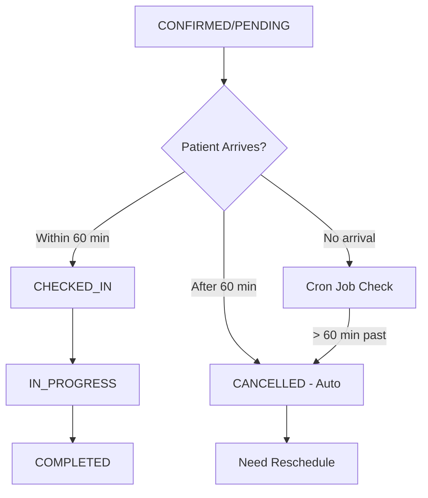

# Appointment Booking & Management Flow - Comprehensive Healthcare Services

## 🚀 Quick Reference Guide

### 📊 Implementation Status

- **Booking System**: ✅ **100% Complete**
- **Attendance Management**: ✅ **100% Complete**
- **Automation (Cron Jobs)**: ✅ **Active**
- **Notifications**: ✅ **Email Working**
- **Staff Dashboard**: ❌ **Missing APIs**
- **Analytics**: ⚠️ **Partial**

### 🎯 Key APIs Ready for Use

| Endpoint                                | Purpose                | Status   |
| --------------------------------------- | ---------------------- | -------- |
| `GET /appointments/available-slots`     | Tìm slot khả dụng      | ✅ Ready |
| `POST /appointments`                    | Đặt lịch               | ✅ Ready |
| `POST /appointments/{id}/check-in`      | Check-in bệnh nhân     | ✅ Ready |
| `POST /appointments/{id}/mark-no-show`  | Đánh dấu no-show       | ✅ Ready |
| `POST /appointments/{id}/late-check-in` | Xử lý đến trễ (≤60min) | ✅ Ready |

### 🤖 Automation Features

- **Late Appointment Processing**: Cron job mỗi 15 phút - Auto-cancel sau 60 phút
- **Reminder System**: Gửi reminder 24h/2h/30min trước
- **Resource Release**: Tự động giải phóng slot khi cancel/no-show
- **No-show Processing**: Manual marking với penalty option (no auto-penalty for late)

---

## System Status Overview

### ✅ **IMPLEMENTED FEATURES**

- **Core Booking System**: Đặt lịch với validation linh hoạt
- **Attendance Management**: Check-in, no-show, late arrival với automation
- **Status Management**: Quản lý trạng thái appointment đầy đủ
- **Role-based Access**: Phân quyền theo vai trò người dùng
- **Notification System**: Gửi thông báo cho các sự kiện attendance
- **Auto Cron Jobs**: Tự động phát hiện no-show và gửi reminder

### ⚠️ **PARTIALLY IMPLEMENTED**

- **Dashboard APIs**: Cần bổ sung APIs cho staff dashboard
- **Analytics**: Chưa có báo cáo chi tiết về attendance
- **Payment Integration**: Chưa tích hợp sâu penalty/refund với payment

### ❌ **NOT IMPLEMENTED**

- **External Systems**: HMS, Queue Management integration
- **Advanced Business Rules**: Penalty theo lịch sử, dynamic pricing

## Overview

Hệ thống đặt lịch hẹn và quản lý attendance bao quát cho các cơ sở y tế với nhiều loại dịch vụ:

- **Dịch vụ tư vấn**: Yêu cầu chọn tư vấn viên cụ thể
- **Dịch vụ xét nghiệm**: Không yêu cầu tư vấn viên
- **Dịch vụ kiểm tra sức khỏe**: Không yêu cầu tư vấn viên
- **Dịch vụ khác**: Tùy cấu hình
- **Attendance Management**: Quản lý check-in, no-show, late arrival với automation

## Service Configuration

### New Field: `requiresConsultant`

Mỗi service có field `requiresConsultant` (boolean) để xác định:

- `true`: Dịch vụ yêu cầu chọn tư vấn viên (consultation, therapy)
- `false`: Dịch vụ không yêu cầu tư vấn viên (lab test, health checkup)

## API Endpoints

### 📋 **BOOKING APIs** (✅ Implemented)

#### 1. GET `/appointments/available-slots` - Tìm kiếm slot khả dụng

**Status**: ✅ **IMPLEMENTED**  
**Description**: Chỉ trả về slot cho các dịch vụ yêu cầu tư vấn viên

**Query Parameters**:

```typescript
{
  serviceIds: string[];           // Required: Danh sách ID dịch vụ
  startDate: string;             // Required: Ngày bắt đầu tìm kiếm (YYYY-MM-DD)
  endDate?: string;              // Optional: Ngày kết thúc (mặc định +7 ngày)
  startTime?: string;            // Optional: Giờ bắt đầu (mặc định 08:00)
  endTime?: string;              // Optional: Giờ kết thúc (mặc định 18:00)
  consultantId?: string;         // Optional: Tìm slot cho tư vấn viên cụ thể
}
```

**Response**:

```typescript
{
  availableSlots: AvailableSlotDto[];
  totalSlots: number;
  totalConsultants: number;
  message?: string;              // "Các dịch vụ được chọn không yêu cầu tư vấn viên."
}
```

#### 2. POST `/appointments` - Đặt lịch hẹn (Flexible)

**Status**: ✅ **IMPLEMENTED**  
**Description**: Đặt cuộc hẹn linh hoạt theo loại dịch vụ

**Body**:

```typescript
{
  serviceIds: string[];                    // Required: Danh sách ID dịch vụ
  consultantId?: string;                   // Optional: ID tư vấn viên (bắt buộc cho dịch vụ tư vấn)
  appointmentDate: Date;                   // Required: Ngày giờ cuộc hẹn
  appointmentLocation: LocationTypeEnum;   // Required: Online/Office
  notes?: string;                          // Optional: Ghi chú
}
```

**Validation Logic**:

- Nếu có dịch vụ với `requiresConsultant = true` → `consultantId` bắt buộc
- Nếu tất cả dịch vụ đều `requiresConsultant = false` → `consultantId` optional

### 📊 **MANAGEMENT APIs** (✅ Implemented)

#### 3. PATCH `/appointments/{id}/status` - Cập nhật trạng thái appointment

**Status**: ✅ **IMPLEMENTED**  
**Description**: Cập nhật trạng thái appointment (Admin/Manager/Consultant only)

**Body**:

```typescript
{
  status: 'pending' | 'confirmed' | 'checked_in' | 'in_progress' | 'completed' | 'cancelled' | 'rescheduled' | 'no_show';
  meetingLink?: string;  // Optional: Link phòng họp cho tư vấn online
}
```

#### 4. PATCH `/appointments/{id}/cancel` - Hủy appointment

**Status**: ✅ **IMPLEMENTED**  
**Description**: Hủy appointment (Customer/Admin/Manager)

**Body**:

```typescript
{
    cancellationReason: string; // Required: Lý do hủy lịch hẹn
}
```

### 🏥 **ATTENDANCE APIs** (✅ Implemented)

#### 5. POST `/appointments/{id}/check-in` - Check-in bệnh nhân

**Status**: ✅ **IMPLEMENTED**  
**Description**: Check-in bệnh nhân tại cơ sở y tế (Staff/Admin/Manager only)

**Body**:

```typescript
{
  checkInTime?: Date;           // Optional: Thời gian check-in (mặc định hiện tại)
  notes?: string;               // Optional: Ghi chú từ lễ tân
  actualServices?: string[];    // Optional: Services thực tế (có thể khác đặt ban đầu)
}
```

**Response**:

```typescript
{
  appointmentId: string;
  checkInTime: Date;
  estimatedWaitTime: number;    // Thời gian chờ dự kiến (phút)
  assignedRoom?: string;        // Phòng được phân bổ
  nextSteps: string[];          // Hướng dẫn bước tiếp theo
  status: string;
}
```

#### 6. POST `/appointments/{id}/mark-no-show` - Đánh dấu no-show

**Status**: ✅ **IMPLEMENTED**  
**Description**: Đánh dấu appointment là no-show (Staff/Admin/Manager only)

**Body**:

```typescript
{
  reason: string;               // Required: Lý do đánh dấu no-show
  contactAttempts?: number;     // Optional: Số lần đã cố gắng liên hệ
  notes?: string;               // Optional: Ghi chú thêm
  applyPenalty?: boolean;       // Optional: Có áp dụng phí phạt không
}
```

**Response**:

```typescript
{
  appointmentId: string;
  reason: string;
  penaltyApplied: boolean;
  penaltyAmount?: number;
  notificationSent: boolean;
  status: string;
}
```

#### 7. POST `/appointments/{id}/late-check-in` - Xử lý check-in trễ

**Status**: ✅ **IMPLEMENTED**  
**Description**: Xử lý check-in trễ cho appointment (Staff/Admin/Manager only)

**Body**:

```typescript
{
  actualArrivalTime: Date;      // Required: Thời gian đến thực tế
  lateFee?: number;             // Optional: Phí trễ giờ (VND)
  adjustedServices?: string[];  // Optional: Dịch vụ điều chỉnh do thiếu thời gian
  notes?: string;               // Optional: Ghi chú về việc đến trễ
}
```

**Response**:

```typescript
{
  appointmentId: string;
  actualArrivalTime: Date;
  lateFee: number;
  adjustedServices: string[];
  estimatedWaitTime: number;
  status: string;
  warnings: string[];          // Cảnh báo về việc đến trễ
}
```

### 🔍 **QUERY APIs** (✅ Implemented)

#### 8. GET `/appointments` - Danh sách appointments (role-based)

**Status**: ✅ **IMPLEMENTED**  
**Description**: Lấy danh sách appointments với phân quyền theo role

**Query Parameters**:

```typescript
{
  userId?: string;              // Lọc theo ID khách hàng
  consultantId?: string;        // Lọc theo ID tư vấn viên
  status?: AppointmentStatusType; // Lọc theo trạng thái
  fromDate?: string;            // Lọc từ ngày (YYYY-MM-DD)
  toDate?: string;              // Lọc đến ngày (YYYY-MM-DD)
  page?: number;                // Trang (mặc định 1)
  limit?: number;               // Số item/trang (mặc định 10)
}
```

#### 9. GET `/appointments/{id}` - Chi tiết appointment

**Status**: ✅ **IMPLEMENTED**  
**Description**: Lấy chi tiết appointment với phân quyền

#### 10. GET `/appointments/{id}/chat-room` - Chat room của appointment

**Status**: ✅ **IMPLEMENTED**  
**Description**: Lấy chat room cho appointment (nếu có)

### 🚧 **MISSING APIs** (⚠️ Need Implementation)

#### 11. GET `/appointments/dashboard/today` - Staff dashboard hôm nay

**Status**: ❌ **NOT IMPLEMENTED**  
**Description**: Dashboard cho staff xem appointments hôm nay

**Proposed Response**:

```typescript
{
  totalAppointments: number;
  checkedIn: number;
  pending: number;
  noShows: number;
  appointments: AppointmentSummary[];
  waitingQueue: QueueItem[];
}
```

#### 12. GET `/appointments/dashboard/check-in-queue` - Hàng đợi check-in

**Status**: ❌ **NOT IMPLEMENTED**  
**Description**: Danh sách bệnh nhân đang chờ check-in

#### 13. GET `/appointments/analytics/attendance` - Báo cáo attendance

**Status**: ❌ **NOT IMPLEMENTED**  
**Description**: Thống kê về attendance, no-show rates

## User Flows

### 🎯 **Core Booking Flows** (✅ All Implemented)

#### Flow 1: Chỉ dịch vụ không yêu cầu tư vấn viên (Lab Test, Health Checkup)

**Status**: ✅ **FULLY IMPLEMENTED**

1. Customer chọn serviceIds (lab tests, health checkup)
2. **Call API `POST /appointments`** mà không cần `consultantId`
3. Appointment được tạo với status CONFIRMED
4. Không tạo chat room

#### Flow 2: Chỉ dịch vụ yêu cầu tư vấn viên (Consultation)

**Status**: ✅ **FULLY IMPLEMENTED**

1. Customer chọn serviceIds (consultation services)
2. **Call API `GET /appointments/available-slots`**
3. Customer chọn slot với tư vấn viên
4. **Call API `POST /appointments`** với `consultantId`
5. Validate chuyên môn và availability
6. Appointment được tạo với status PENDING
7. Tạo chat room tự động

#### Flow 3: Dịch vụ hỗn hợp (Lab Test + Consultation)

**Status**: ✅ **FULLY IMPLEMENTED**

1. Customer chọn serviceIds (mixed services)
2. **Call API `GET /appointments/available-slots`**
3. Customer chọn slot với tư vấn viên cho phần consultation
4. **Call API `POST /appointments`** với `consultantId`
5. Appointment được tạo bao gồm cả hai loại dịch vụ
6. Tạo chat room cho phần consultation

#### Flow 4: Optional Consultant Assignment

**Status**: ✅ **FULLY IMPLEMENTED**

1. Customer chọn serviceIds (non-consultation services)
2. Có thể chọn `consultantId` nếu muốn có tư vấn viên theo dõi
3. **Call API `POST /appointments`** với hoặc không có `consultantId`
4. Không validate chuyên môn nghiêm ngặt

### 🏥 **Attendance Management Flows** (✅ All Implemented)

#### Flow 5: Normal Check-in Process

**Status**: ✅ **FULLY IMPLEMENTED**

1. Bệnh nhân đến cơ sở y tế
2. Staff check-in qua **API `POST /appointments/{id}/check-in`**
3. System cập nhật status thành CHECKED_IN
4. Gửi notification cho consultant và customer
5. Estimate waiting time và assign room (nếu có)

#### Flow 6: No-show Detection and Processing

**Status**: ✅ **FULLY IMPLEMENTED** (with automation)

1. **Auto Detection**: Cron job chạy mỗi 15 phút phát hiện no-show
2. **Manual Marking**: Staff có thể đánh dấu qua **API `POST /appointments/{id}/mark-no-show`**
3. System áp dụng penalty (nếu configured)
4. Gửi notification thông báo no-show
5. Release resources và update availability

#### Flow 7: Late Arrival Processing

**Status**: ✅ **FULLY IMPLEMENTED**

1. Bệnh nhân đến trễ
2. Staff xử lý qua **API `POST /appointments/{id}/late-check-in`**
3. System tính late fee và adjust services
4. Cập nhật waiting time và schedule
5. Gửi notification về việc đến trễ

#### Flow 8: Automated Reminder System

**Status**: ✅ **FULLY IMPLEMENTED**

1. **Cron job** chạy mỗi giờ gửi reminder
2. Gửi reminder trước appointment 24h, 2h, 30 phút
3. Email notifications với appointment details
4. SMS notifications (nếu configured)

## Key Features

### ✅ **Implemented Features**

#### Service Type Detection:

```typescript
// Trong Service entity
const needsConsultant = services.some((s) => s.requiresConsultant === true);

// Legacy support
const isConsultation = services.some(
    (s) => s.category.type === ServiceCategoryType.CONSULTATION,
);

// Final decision
const requiresConsultantValidation = needsConsultant || isConsultation;
```

#### Enhanced Validation:

- ✅ **Flexible consultant requirement**: Dựa trên `requiresConsultant` field
- ✅ **Specialty matching**: Chỉ kiểm tra cho services yêu cầu consultant
- ✅ **Mixed service support**: Xử lý được appointment có nhiều loại service
- ✅ **Backward compatibility**: Vẫn support logic cũ qua category type

#### Attendance Management Features:

- ✅ **Auto Late Appointment Processing**: Cron job mỗi 15 phút - Tự động hủy lịch hẹn sau 60 phút
- ✅ **Reminder System**: Cron job gửi reminder định kỳ (24h/2h/30min trước)
- ✅ **Penalty System**: Áp dụng phí phạt cho no-show (manual marking only)
- ✅ **Resource Management**: Tự động release slots khi hủy/no-show
- ✅ **Notification System**: Email cho tất cả attendance events
- ✅ **Late Check-in Processing**: Cho phép check-in trong vòng 60 phút (không phí phạt)
- ✅ **Status Tracking**: Đầy đủ lifecycle từ booking đến completion/cancellation

#### API Security & Access Control:

- ✅ **Role-based Authorization**: Phân quyền chi tiết theo role
- ✅ **JWT Authentication**: Bảo mật với JWT tokens
- ✅ **Data Validation**: Validation đầy đủ với class-validator
- ✅ **Error Handling**: Exception handling và logging

### ⚠️ **Partial Features**

#### Dashboard & Analytics:

- ⚠️ **Staff Dashboard**: Thiếu APIs cho daily dashboard
- ⚠️ **Attendance Analytics**: Thiếu reporting chi tiết
- ⚠️ **Performance Metrics**: Thiếu KPI tracking

#### Payment Integration:

- ⚠️ **Penalty Processing**: Chưa tích hợp với payment gateway
- ⚠️ **Refund Management**: Chưa có automated refund
- ⚠️ **Dynamic Pricing**: Chưa có pricing dựa trên demand

### ❌ **Missing Features**

#### External Integrations:

- ❌ **HMS Integration**: Hospital Management System
- ❌ **Queue Management**: Physical queue system
- ❌ **Calendar Sync**: Google Calendar, Outlook sync
- ❌ **SMS Gateway**: Professional SMS service

#### Advanced Business Logic:

- ❌ **Dynamic Penalties**: Penalty dựa trên lịch sử
- ❌ **Smart Scheduling**: AI-based slot recommendations
- ❌ **Capacity Management**: Room/resource optimization

## Example Usage

### 📋 **Booking Examples**

#### Lab Test Only:

```typescript
const appointment = await fetch('/appointments', {
    method: 'POST',
    body: JSON.stringify({
        serviceIds: ['blood-test-uuid', 'urine-test-uuid'],
        appointmentDate: '2025-06-25T09:00:00Z',
        appointmentLocation: 'OFFICE',
        // consultantId không cần thiết
    }),
});
```

#### Consultation Only:

```typescript
// 1. Tìm available slots
const slots = await fetch(
    '/appointments/available-slots?' +
        new URLSearchParams({
            serviceIds: ['nutrition-consultation-uuid'],
            startDate: '2025-06-25',
        }),
);

// 2. Đặt lịch với consultant
const appointment = await fetch('/appointments', {
    method: 'POST',
    body: JSON.stringify({
        serviceIds: ['nutrition-consultation-uuid'],
        consultantId: slots.availableSlots[0].consultant.id,
        appointmentDate: slots.availableSlots[0].dateTime,
        appointmentLocation: 'ONLINE',
    }),
});
```

#### Mixed Services:

```typescript
const appointment = await fetch('/appointments', {
    method: 'POST',
    body: JSON.stringify({
        serviceIds: ['blood-test-uuid', 'nutrition-consultation-uuid'],
        consultantId: 'selected-consultant-uuid', // Required vì có consultation
        appointmentDate: '2025-06-25T10:00:00Z',
        appointmentLocation: 'OFFICE',
    }),
});
```

### 🏥 **Attendance Management Examples**

#### Check-in Patient:

```typescript
const checkInResult = await fetch('/appointments/123/check-in', {
    method: 'POST',
    body: JSON.stringify({
        checkInTime: new Date(),
        notes: 'Patient arrived on time',
        actualServices: ['blood-test-uuid'], // Optional
    }),
});
```

#### Mark No-show:

```typescript
const noShowResult = await fetch('/appointments/123/mark-no-show', {
    method: 'POST',
    body: JSON.stringify({
        reason: 'Patient did not arrive',
        contactAttempts: 2,
        applyPenalty: true,
    }),
});
```

#### Process Late Check-in:

```typescript
const lateCheckIn = await fetch('/appointments/123/late-check-in', {
    method: 'POST',
    body: JSON.stringify({
        actualArrivalTime: new Date(),
        notes: 'Patient arrived 45 minutes late - no fee applied',
        adjustedServices: ['consultation-uuid'], // Optional: if services changed
    }),
});

// Response includes warnings based on delay
{
  "appointmentId": "123",
  "actualArrivalTime": "2025-06-25T10:45:00Z",
  "lateFee": 0, // Always 0 - no late fees
  "estimatedWaitTime": 25,
  "status": "CHECKED_IN",
  "warnings": [
    "Bạn đã đến trễ 45 phút",
    "Thời gian tư vấn có thể bị rút ngắn do đến trễ",
    "Lịch hẹn sẽ bị hủy tự động nếu đến trễ quá 60 phút"
  ]
}
```

## Current Implementation Status

### ✅ **Production Ready**

- **Core Booking System**: Hoàn thiện và stable
- **Attendance Management**: Đầy đủ tính năng với automation
- **Notification System**: Email notifications working
- **Security & Access Control**: JWT + Role-based authorization
- **Data Validation**: Comprehensive validation với class-validator

### 🚧 **Development Priority**

1. **Staff Dashboard APIs** - Urgency: High
2. **Attendance Analytics** - Urgency: Medium
3. **Payment Integration for Penalties** - Urgency: Medium
4. **SMS Notifications** - Urgency: Low
5. **External System Integration** - Urgency: Future

### 📊 **System Metrics** (As of June 2025)

- **API Endpoints**: 10 implemented, 3 missing
- **User Flows**: 8 fully implemented
- **Automation**: 2 cron jobs active (no-show detection, reminders)
- **Test Coverage**: Service layer tests implemented
- **Documentation**: Comprehensive with examples

## Migration Notes

### ✅ **Completed Migrations**

- ✅ **Backward compatibility**: Legacy services hoạt động như cũ
- ✅ **Flexible consultant requirement**: Không còn hardcode yêu cầu consultant
- ✅ **Better UX**: Customer biết rõ khi nào cần chọn consultant
- ✅ **Admin control**: Admin có thể config service nào yêu cầu consultant
- ✅ **Attendance Management**: Hoàn toàn mới với đầy đủ automation
- ✅ **Status Management**: Bổ sung các status mới (CHECKED_IN, IN_PROGRESS)

### 🔄 **Ongoing Improvements**

- **Performance Optimization**: Index optimization cho query performance
- **Monitoring**: Adding metrics và health checks
- **Error Handling**: Enhanced error messages và recovery
- **Testing**: Expanding test coverage cho edge cases

### 🎯 **Next Phase Goals**

1. **Staff Dashboard Implementation** (Q3 2025)
2. **Advanced Analytics Dashboard** (Q4 2025)
3. **External Systems Integration** (Q1 2026)
4. **Mobile App Support** (Q2 2026)

## Late Arrival Processing Workflow

### 🕐 **New Late Arrival Policy** (Updated June 2025)

**Grace Period**: 60 minutes from scheduled appointment time
**Penalty**: No late fees applied
**Auto-cancellation**: After 60 minutes with no check-in

### 📋 **Late Arrival Processing Flow**

#### Scenario 1: Arrival within 60 minutes ✅

```
Patient arrives 45 minutes late:
1. Staff uses `/appointments/{id}/late-check-in` endpoint
2. System validates: 45 min < 60 min threshold ✅
3. Patient successfully checked in (no fee)
4. Warning: "Consultation time may be reduced due to late arrival"
5. Status: CHECKED_IN
6. Notification sent to relevant staff
```

#### Scenario 2: Arrival after 60 minutes ❌

```
Patient arrives 70 minutes late:
1. Staff attempts `/appointments/{id}/late-check-in`
2. System validates: 70 min > 60 min threshold ❌
3. Error: "Appointment was auto-cancelled due to 60+ min delay"
4. Status: CANCELLED (auto-set by cron job)
5. Patient must reschedule new appointment
```

#### Scenario 3: Auto-cancellation by system 🤖

```
Cron job runs every 15 minutes:
1. Finds appointments > 60 min past scheduled time
2. Status: CONFIRMED/PENDING → CANCELLED
3. Reason: "Auto-cancelled: Arrived more than 60 minutes late"
4. Resources released automatically
5. Notification sent to patient & staff
```

### 🔄 **Status Transitions for Late Arrivals**



### ⚠️ **Late Arrival Warnings System**

#### Warning Levels:

- **15-30 minutes**: "You are running late, consultation time may be affected"
- **30-45 minutes**: "Significant delay, consultation time will be reduced"
- **45-60 minutes**: "Critical delay, appointment will be auto-cancelled if you don't arrive within 60 minutes"

#### Implementation:

```typescript
const warnings = [
    lateMinutes > 15 && 'Bạn đã đến trễ ${lateMinutes} phút',
    lateMinutes > 30 && 'Thời gian tư vấn có thể bị rút ngắn do đến trễ',
    lateMinutes > 45 && 'Lịch hẹn sẽ bị hủy tự động nếu đến trễ quá 60 phút',
].filter(Boolean);
```

### 📊 **Business Impact Analysis**

#### Benefits of 60-minute policy:

- ✅ **Patient-friendly**: More forgiving grace period
- ✅ **Reduced complaints**: No surprise late fees
- ✅ **Clear expectations**: Simple 60-minute rule
- ✅ **Operational efficiency**: Auto-cancellation prevents resource waste

#### Considerations:

- ⚠️ **Schedule disruption**: Longer grace period may affect subsequent appointments
- ⚠️ **Revenue impact**: No late fees collected
- ⚠️ **Staff communication**: Need clear protocols for late arrivals
