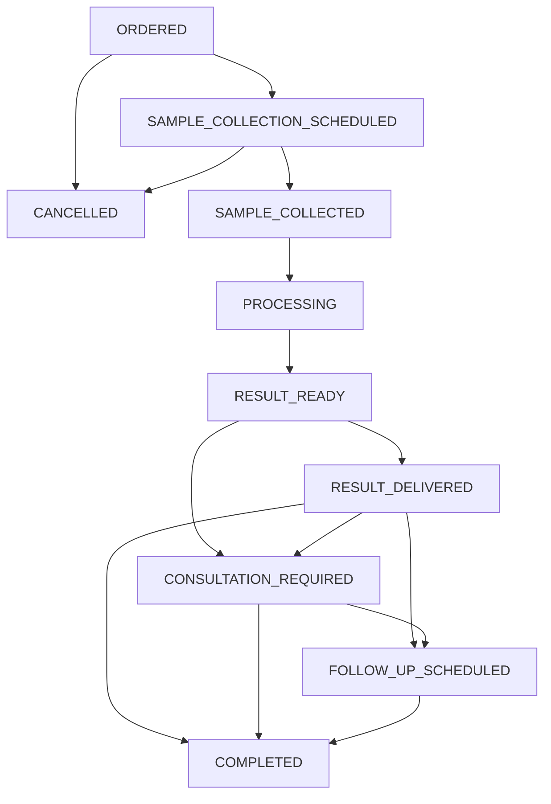

# STI Test Process Flow Documentation

## Tổng quan về Quy trình Xét nghiệm STI

Quy trình xét nghiệm STI (Sexually Transmitted Infections) là một quy trình được thiết kế để quản lý toàn bộ chu kỳ xét nghiệm từ khi đặt đơn cho đến khi hoàn thành điều trị và theo dõi.

## 🔄 Workflow States (Trạng thái Quy trình)

### 1. ORDERED (Đã đặt xét nghiệm)

- **Mô tả**: Đơn xét nghiệm STI đã được tạo và chờ lên lịch lấy mẫu
- **Yêu cầu**:
    - Thông tin bệnh nhân đầy đủ
    - Dịch vụ được chọn
- **Thời gian ước tính**: Ngay lập tức
- **Bước tiếp theo**:
    - `SAMPLE_COLLECTION_SCHEDULED` (Lên lịch lấy mẫu)
    - `CANCELLED` (Hủy bỏ)

### 2. SAMPLE_COLLECTION_SCHEDULED (Đã lên lịch lấy mẫu)

- **Mô tả**: Đã lên lịch cuộc hẹn để lấy mẫu xét nghiệm
- **Yêu cầu**:
    - Cuộc hẹn được đặt
    - Bệnh nhân xác nhận
- **Thời gian ước tính**: 24-48 giờ
- **Bước tiếp theo**:
    - `SAMPLE_COLLECTED` (Đã lấy mẫu)
    - `CANCELLED` (Hủy bỏ)

### 3. SAMPLE_COLLECTED (Đã lấy mẫu)

- **Mô tả**: Mẫu xét nghiệm đã được thu thập thành công
- **Yêu cầu**:
    - Mẫu chất lượng tốt
    - Thông tin người lấy mẫu
    - Nhãn mẫu chính xác
- **Thời gian ước tính**: 1 giờ
- **Bước tiếp theo**:
    - `PROCESSING` (Đang xử lý)

### 4. PROCESSING (Đang xử lý)

- **Mô tả**: Mẫu đang được phân tích tại phòng lab
- **Yêu cầu**:
    - Mẫu đã chuyển đến lab
    - Lab xác nhận nhận mẫu
- **Thời gian ước tính**: 24-72 giờ
- **Bước tiếp theo**:
    - `RESULT_READY` (Kết quả sẵn sàng)

### 5. RESULT_READY (Kết quả sẵn sàng)

- **Mô tả**: Kết quả xét nghiệm đã hoàn thành và chờ giao cho bệnh nhân
- **Yêu cầu**:
    - Kết quả đã được kiểm tra
    - Báo cáo hoàn thành
- **Thời gian ước tính**: 1 giờ
- **Bước tiếp theo**:
    - `RESULT_DELIVERED` (Đã giao kết quả)
    - `CONSULTATION_REQUIRED` (Cần tư vấn)

### 6. RESULT_DELIVERED (Đã giao kết quả)

- **Mô tả**: Kết quả đã được giao cho bệnh nhân
- **Yêu cầu**:
    - Bệnh nhân đã nhận kết quả
    - Xác nhận giao kết quả
- **Thời gian ước tính**: Ngay lập tức
- **Bước tiếp theo**:
    - `CONSULTATION_REQUIRED` (Cần tư vấn)
    - `FOLLOW_UP_SCHEDULED` (Lên lịch theo dõi)
    - `COMPLETED` (Hoàn thành)

### 7. CONSULTATION_REQUIRED (Cần tư vấn)

- **Mô tả**: Kết quả cần tư vấn thêm từ bác sĩ chuyên khoa
- **Yêu cầu**:
    - Bác sĩ tư vấn được chỉ định
    - Lịch tư vấn được sắp xếp
- **Thời gian ước tính**: 24-48 giờ
- **Bước tiếp theo**:
    - `FOLLOW_UP_SCHEDULED` (Lên lịch theo dõi)
    - `COMPLETED` (Hoàn thành)

### 8. FOLLOW_UP_SCHEDULED (Đã lên lịch theo dõi)

- **Mô tả**: Đã lên lịch các cuộc hẹn theo dõi cần thiết
- **Yêu cầu**:
    - Lịch theo dõi được xác nhận
    - Hướng dẫn điều trị
- **Thời gian ước tính**: 1 giờ
- **Bước tiếp theo**:
    - `COMPLETED` (Hoàn thành)

### 9. COMPLETED (Hoàn thành)

- **Mô tả**: Toàn bộ quy trình xét nghiệm STI đã hoàn thành
- **Yêu cầu**:
    - Tất cả bước đã hoàn thành
    - Tài liệu được lưu trữ
- **Thời gian ước tính**: Ngay lập tức
- **Bước tiếp theo**: Không có (trạng thái cuối)

### 10. CANCELLED (Đã hủy)

- **Mô tả**: Quy trình xét nghiệm đã bị hủy bỏ
- **Yêu cầu**:
    - Lý do hủy bỏ được ghi nhận
    - Thông báo cho bệnh nhân
- **Thời gian ước tính**: Ngay lập tức
- **Bước tiếp theo**: Không có (trạng thái cuối)

---

## 📋 Loại Mẫu Xét nghiệm (Sample Types)

| Loại     | Tên       | Mô tả                                   |
| -------- | --------- | --------------------------------------- |
| `BLOOD`  | Máu       | Mẫu máu để xét nghiệm                   |
| `URINE`  | Nước tiểu | Mẫu nước tiểu                           |
| `SWAB`   | Tăm bông  | Mẫu tăm bông từ các vùng cần xét nghiệm |
| `SALIVA` | Nước bọt  | Mẫu nước bọt                            |
| `OTHER`  | Khác      | Các loại mẫu khác                       |

---

## 🚨 Độ Ưu tiên Xử lý (Priority Levels)

| Mức độ   | Tên         | Mô tả                          |
| -------- | ----------- | ------------------------------ |
| `NORMAL` | Bình thường | Xử lý theo thứ tự thông thường |
| `HIGH`   | Cao         | Ưu tiên xử lý trước            |
| `URGENT` | Khẩn cấp    | Xử lý ngay lập tức             |

---

## 🔗 Mối quan hệ và Dependencies

### Entities liên quan:

1. **User (Patient)** - Bệnh nhân thực hiện xét nghiệm
2. **User (Consultant Doctor)** - Bác sĩ tư vấn (nếu cần)
3. **Service** - Dịch vụ xét nghiệm được chọn
4. **Appointment** - Cuộc hẹn lấy mẫu
5. **TestResult** - Kết quả xét nghiệm

---

## 🔄 Workflow Diagram

---

## 🎯 API Endpoints

### Quản lý STI Test Process

- `POST /sti-test-processes` - Tạo mới quy trình xét nghiệm
- `GET /sti-test-processes/test-code/:testCode` - Lấy thông tin theo mã xét nghiệm
- `GET /sti-test-processes/:id` - Lấy chi tiết quy trình
- `PUT /sti-test-processes/:id` - Cập nhật thông tin quy trình
- `PATCH /sti-test-processes/:id/status` - Cập nhật trạng thái
- `DELETE /sti-test-processes/:id` - Xóa quy trình

### Workflow Management

- `GET /sti-test-processes/workflow/steps` - Lấy danh sách các bước workflow
- `GET /sti-test-processes/workflow/next-steps/:status` - Lấy các bước tiếp theo
- `POST /sti-test-processes/:id/workflow/transition` - Chuyển đổi trạng thái với validation

### Tìm kiếm và Lọc

- `POST /sti-test-processes/search` - Tìm kiếm với điều kiện
- `POST /sti-test-processes/patient/:patientId` - Lấy danh sách theo bệnh nhân

---

## 🔐 Phân quyền Truy cập

### Roles có quyền truy cập:

- **ADMIN** - Toàn quyền
- **MANAGER** - Quản lý và giám sát
- **STAFF** - Thực hiện các thao tác thường ngày
- **CONSULTANT** - Xem thông tin bệnh nhân của mình

### Quyền hạn cụ thể:

- **Tạo/Sửa/Xóa**: ADMIN, MANAGER, STAFF
- **Xem thông tin**: Tất cả roles (theo phạm vi)
- **Workflow transition**: ADMIN, MANAGER, STAFF

---

## 📊 Tracking và Monitoring

### Thông tin được theo dõi:

1. **Thời gian**: Tạo, cập nhật, các mốc thời gian quan trọng
2. **Người thực hiện**: Người lấy mẫu, xử lý lab, tư vấn
3. **Trạng thái**: Theo dõi chuyển đổi trạng thái
4. **Thông báo**: Email, SMS cho bệnh nhân
5. **Bảo mật**: Đảm bảo tính bảo mật thông tin

### Báo cáo và Analytics:

- Thống kê theo thời gian xử lý
- Phân tích hiệu suất workflow
- Theo dõi chất lượng dịch vụ
- Báo cáo tuân thủ quy định

---

## ⚠️ Lưu ý quan trọng

1. **Bảo mật thông tin**: Tất cả thông tin xét nghiệm STI đều được đánh dấu confidential
2. **Tuân thủ quy định**: Workflow tuân thủ các quy định y tế về xét nghiệm STI
3. **Thông báo bệnh nhân**: Hệ thống tự động thông báo cho bệnh nhân ở các bước quan trọng
4. **Backup dữ liệu**: Định kỳ sao lưu dữ liệu để đảm bảo an toàn
5. **Audit trail**: Ghi nhận tất cả các thay đổi để có thể truy vết

---

_Tài liệu này được cập nhật lần cuối: June 27, 2025_
